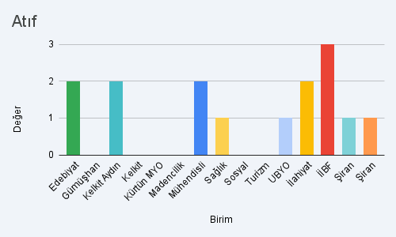
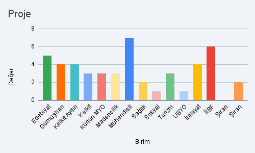
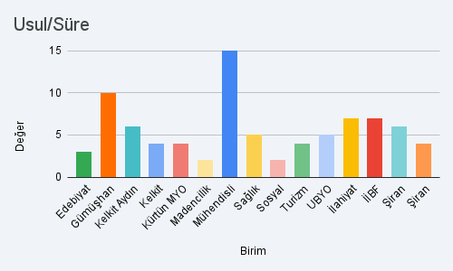
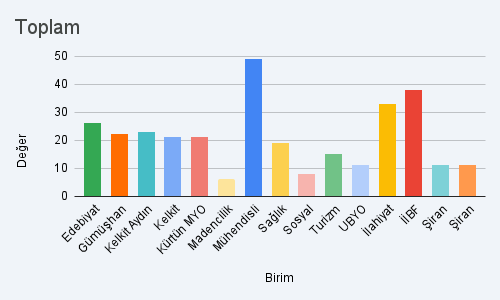

# Öğretim Üyeliğine Yükseltilme ve Atanma Yönergesi - Değişiklik Talepleri Analizi

Bu rapor, Gümüşhane Üniversitesi'nin çeşitli akademik birimlerinden toplanan **Öğretim Üyeliğine Yükseltilme ve Atanma Yönergesi** değişiklik taleplerinin kapsamlı bir analizini sunmaktadır.

---

## Birimler Bazında Değişiklik Talepleri Dağılımı

Aşağıdaki grafikler, her kategorideki değişiklik taleplerinin birimler bazında dağılımını göstermektedir.

---

### 1. Yabancı Dil Puanı Değişiklik Talepleri

**Analiz:**
- **En çok talep eden birim:** İİBF (4 değişiklik)
- **Orta düzey talep:** Gümüşhane MYO, Kelkit Aydın, Kelkit MYO, Kürtün MYO, Mühendislik (3'er değişiklik)
- **Düşük talep:** Sağlık, Sosyal, Turizm, UBYO, Şiran birimleri (0-1 değişiklik)
- **Genel eğilim:** ÜAK doçentlik barajı 55 iken, Dr. Öğr. Üyesi için 60, Doçent/Profesör için 65 puan istenmesi eleştirilmektedir.

**Önerilen Değişiklik:** Tüm kadrolar için yabancı dil puanının **55** olarak belirlenmesi.

---

### 2. Yayın Puanı Değişiklik Talepleri

**Analiz:**
- **En çok talep eden birimler:** İlahiyat ve İİBF (10'ar değişiklik)
- **Yüksek talep:** Kelkit MYO, Mühendislik (8'er değişiklik)
- **Orta düzey:** Edebiyat (7), Kelkit Aydın (5), Sağlık (5)
- **Düşük talep:** Madencilik, Kürtün MYO, UBYO (0-1 değişiklik)

**Öne Çıkan Talepler:**
- SCOPUS ve ESCI yayınlarının puanlarının artırılması
- BKCI/Scopus kitap bölümlerinin puanlamaya dahil edilmesi
- Ortak çalışmalarda puan bölünmesi yerine teşvik edici model

---

### 3. Asgari Puan Değişiklik Talepleri

**Analiz:**
- **En çok talep eden birim:** Mühendislik (10 değişiklik)
- **Yüksek talep:** İİBF (8), İlahiyat (6)
- **Orta düzey:** Edebiyat, Kelkit Aydın (4-6 değişiklik)
- **Genel sorun:** Dr. Öğr. Üyesi yeniden atanma puanının (80-85) doçentlik seviyesine yakın olması

**Önerilen Değişiklik:** Dr. Öğr. Üyesi yeniden atanma puanının **40-50** aralığına düşürülmesi.

---

### 4. Atıf Değişiklik Talepleri

**Analiz:**
- **En çok talep eden birim:** İİBF (3 değişiklik)
- **Orta düzey:** Edebiyat, Kelkit Aydın, Kelkit MYO, Mühendislik, UBYO, İlahiyat (1-2 değişiklik)
- **Talep etmeyen:** Madencilik, Kürtün MYO, Sağlık, Sosyal, Turizm

**Öne Çıkan Talepler:**
- H-indeksi barajının alan bazlı revize edilmesi
- Sosyal bilimler için H-indeksinin düşürülmesi (Dr: 4, Doç: 5, Prof: 8)

---

### 5. Proje Değişiklik Talepleri

**Analiz:**
- **En çok talep eden birim:** Mühendislik (7 değişiklik)
- **Yüksek talep:** İİBF (6), Edebiyat (5)
- **Orta düzey:** Gümüşhane MYO, Kelkit Aydın, Kelkit MYO, İlahiyat (3-4 değişiklik)
- **Düşük talep:** Sosyal (1), Şiran (0)

**Öne Çıkan Talepler:**
- TÜBİTAK 2209-A/B öğrenci projeleri puanının 2'den **5-8**'e çıkarılması
- Yeniden atanmada proje şartının (15P) zorunlu olmaktan çıkarılması
- Proje yerine alternatif (makale/kitap) sunulabilmesi

---

### 6. Editörlük ve Hakemlik Değişiklik Talepleri

**Analiz:**
- **En çok talep eden birim:** Mühendislik (4 değişiklik)
- **Yüksek talep:** İlahiyat (3)
- **Orta düzey:** Gümüşhane MYO, Kelkit Aydın, Kelkit MYO, Sosyal, Turizm (2'şer değişiklik)
- **Düşük talep:** Edebiyat, İİBF, Sağlık (0-1 değişiklik)

**Öne Çıkan Talepler:**
- Editörlük ve hakemlik puanlarının artırılması
- Komisyon ve idari görev puanlarının artırılması

---

### 7. Usul ve Süre Değişiklik Talepleri

**Analiz:**
- **En çok talep eden birim:** Mühendislik (15 değişiklik)
- **Yüksek talep:** Gümüşhane MYO (10), İlahiyat (7), İİBF (7)
- **Orta düzey:** Kelkit Aydın (6), Sağlık (5), UBYO (5)
- **Düşük talep:** Sosyal (2), Şiran birimleri (3-4)

**Öne Çıkan Talepler:**
- Profesörlük süreklilik kriteri (Madde 13/2) tamamen kaldırılmalı
- Yönerge yürürlük tarihi 2028 sonu veya 2029'a ertelenmeli
- Önlisans-lisans ders puanı eşitlenmeli
- Yarıyıl başına ders sınırı kaldırılmalı

---

### 8. Toplam Değişiklik Talepleri

**Genel Değerlendirme:**

| Sıra | Birim | Toplam Talep |
|------|-------|--------------|
| 1 | Mühendislik ve Doğa Bilimleri | ~49 |
| 2 | İİBF | ~38 |
| 3 | İlahiyat Fakültesi | ~33 |
| 4 | Edebiyat Fakültesi | ~25 |
| 5 | Kelkit Aydın Doğan MYO | ~23 |
| 6 | Gümüşhane MYO | ~22 |
| 7 | Kelkit MYO | ~21 |
| 8 | Kürtün MYO | ~20 |
| 9 | Sağlık Bilimleri | ~18 |
| 10 | Turizm Fakültesi | ~15 |
| 11 | UBYO | ~11 |
| 12 | Şiran Dursun Keleş MYO | ~11 |
| 13 | Şiran Mustafa Beyaz MYO | ~11 |
| 14 | Sosyal Bilimler MYO | ~8 |
| 15 | Madencilik İhtisaslaşma | ~7 |

---

## Öncelik Sıralamasına Göre Değişiklik Gerektiren Konular

### A. Acil Değişiklik Gerektiren (Tüm/Çoğu Birim Talep Ediyor)

1. **Dr. Öğr. Üyesi yeniden atanma puanı** → 80-85'ten 40-50'ye düşürülmeli
2. **TÜBİTAK 2209 öğrenci projeleri puanı** → 2'den en az 5'e çıkarılmalı
3. **Profesörlük süreklilik kriteri (Madde 13/2)** → Kaldırılmalı
4. **Yabancı dil puanları** → ÜAK barajına (55) indirilmeli
5. **Proje şartı zorunluluğu** → Alternatif sunulmalı veya esnetilmeli

### B. Yüksek Öncelikli (Birçok Birim Talep Ediyor)

6. Önlisans-lisans ders puanı eşitliği
7. Yarıyıl başına ders sınırının kaldırılması
8. Yönerge yürürlük tarihinin ertelenmesi
9. SCOPUS/ESCI puanlarının artırılması
10. BKCI/Scopus kitap bölümlerinin puanlanması

### C. Orta Öncelikli (Belirli Birim Grupları Talep Ediyor)

11. A1-A3 yeterli ise A4 zorunluluğunun kaldırılması
12. Lisansüstü programsız birimlere esneklik
13. H-indeksi barajının alan bazlı revizyonu
14. Ortak çalışma katsayılarının düzenlenmesi
15. İdari görev puanlarının artırılması

---

## Sonuç

Bu analiz, **15 farklı akademik birimden** toplanan görüşlerin sistematik bir değerlendirmesini sunmaktadır. En yüksek konsensüs aşağıdaki konularda sağlanmıştır:

- **Yeniden Atanma Puanı:** 12+ birim
- **Proje Puanları:** 10+ birim
- **Yabancı Dil:** 9+ birim
- **Profesörlük Sürekliliği:** 8+ birim
- **Yayın Puanları:** 8+ birim

Detaylı birim bazlı raporlar için ilgili klasörlerdeki markdown dosyalarına başvurulabilir.

---

*Bu rapor, tüm birimlerin görüşlerinin analiz edilmesiyle hazırlanmıştır.*
